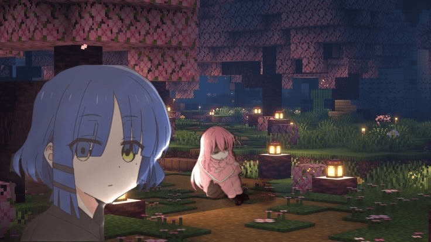

  

# Hi, I'm Whitey 👋

I'm a high school student interested in programming, computer science, and building useful projects.

---

## 👤 About Me

- 🐍 Python Enthusiast
- 🤖 Telegram Bot Developer
- 💻 Open Source Enthusiast
- 🧩 Competitive Programming Learner

---

## 🌱 Interested In

- Python
- C++
- Telegram Bot Development
- Competitive Programming
- Computer Science
- Open Source

---

## 🚀 Current Project

- 📚 Learn aiogram v3  
  A complete open-source course for learning Telegram bot development.

---

## 📈 Activity Graph

  

---

## 🛠️ Languages & Tools

---

## 📫 Contact

- Telegram: **@The_whitey**
- GitHub Issues are always welcome.

---

## 🎮 Outside Programming

I also like anime, video games, and calm music.

---

*"Building while learning.."*

  

